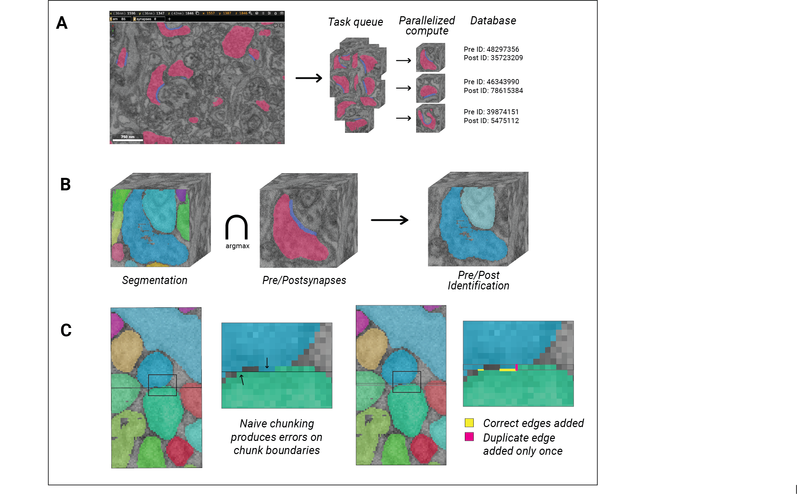

# Cloudome

A command line utility for executing highly parallelizable jobs on volumetric neuroscience datasets using cloud or HPC resources. Currently supports connectomes, contactomes, cell volume measurements, and more. Uses a producer-consumer model to split a task into many subtasks, add them to a queue, scale execution according to available resources, then unite the many results into a single database. 

See [Docs](./docs) for instructions on getting started. Currently, only Neuroglancer precomputed format is supported.

## Features
| Data product | Requirements | About |
| --- | --- | --- |
| Connectome | segmentation layer, synapse layer with pre and post annotated separately | Connectome tasks are split into one subtask per synapse. The calculation determines what two cells are participating in the given synapse. Results are aggregated by concatenation. |
| Contactomes | segmentation layer | Contactome tasks are split into subtasks volumetrically according to a given chunk size. Results are aggregated with an intelligent chunking method that ensures no duplicate edges due to chunk boundary artifacts. |
| Cell volume measurement | segmentation layer | Volume tasks are split into subtasks volumetrically according to a given chunk size. Volume measurements from each chunk are summed to produce a single value per cell. |
| Custom function | you write yourself! | |

We recommend running connectomes on AWS and chunk-wise calculations on an HPC cluster, as connectome subtasks are very small and therefore good candidates for extreme parallelization. Chunk-wise calculations will become more efficient as chunk size increases and are therefore better candidates for an HPC cluster.

See [AWS](./docs/AWS.md) for instructions on using Zappa with the AWS tools SQS, Lambda, and DynamoDB to complete a job. Results can be downloaded from DynamoDB as a CSV. With this setup, connectomes cost about $1/25k synapses to compute, and execution time is limited only by how quickly jobs can be queued from the local machine.

See [Local](./docs/Local.md) for instructions on completing a job using a local HPC cluster. Results are pushed to a SQLite DB, with an optional script to export as CSV.

The following explanatory figure is published in [Connectome quality converges predictably to reveal optimal stopping points during proofreading](https://doi.org/10.64898/2026.06.30.735414):
<figure>
  
  <figcaption>
		<strong>A)</strong> For a connectome task, an EM image in Neuroglancer helps the user identify individual synapses, with pink representing the presynapse and blue representing the postsynaptic density. To generate a full connectome, Cloudome creates one pre- and postsynaptic partner identification task per synapse and schedules them on parallelizable architecture, then saves results in a database. 
		  
		<strong>B)</strong> One connectome task identifies the cell IDs participating in one synapse. Two registered cuboids of segmentation and synapse paint are compared to determine synaptic partners. These two data layers are prerequisites for a Cloudome-computed connectome. 
		  
		<strong>C)</strong> A contactome task is one kind of volumetric task that Cloudome supports. To compute one contactome task, the contacting surface area of adjacent segmentation IDs is computed for one cuboid of segmentation. A one voxel overlap on three out of six chunk faces is added to account for edge effects (yellow). Duplicated edges in the overlap regions (pink) are accounted for only once.
  </figcaption>
</figure>

## Attribution

For questions or collaboration inquiries, please email hannah.martinez@jhuapl.edu or jordan.matelsky@jhuapl.edu.

Please cite [Connectome quality converges predictably to reveal optimal stopping points during proofreading](https://doi.org/10.64898/2026.06.30.735414) if this codebase is helpful to your research.

This software was created by the Johns Hopkins University Applied Physics Laboratory, with funding supported by the NIH BRAIN Initiative under grant no. R24MH114785.

The views, opinions, and/or findings expressed are those of the author(s) and should not be interpreted as representing the official views or policies of the NIH.

© 2026 The Johns Hopkins University Applied Physics Laboratory LLC
